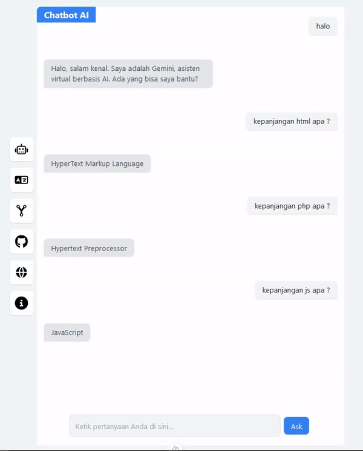

# chatbot-translate-myip-nuxt
Nuxt + Vue Basic Application is a platform that combines the power of Nuxt.js, a Vue.js framework used to create powerful and scalable web applications, with the capabilities of Vue.js, a JavaScript library focused on developing responsive user interfaces and interactive. 

## Install
```
git clone https://github.com/fitri-hy/chatbot-translate-myip-nuxt.git
cd chatbot-translate-myip-nuxt
npm install
npm run dev
```


